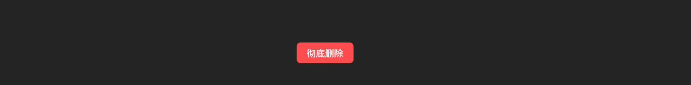
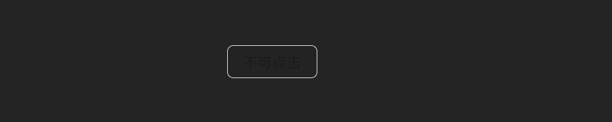
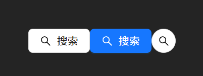
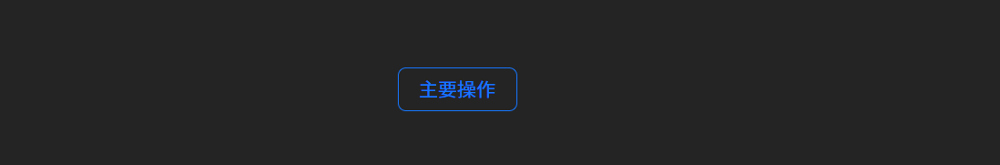

# button

## type

- primary：主操作（一个页面/一个区域通常只放 1 个）
- default：普通操作（最常见）
- dashed：弱强调/补充操作
- text：像文字一样，弱操作（工具栏、列表项操作）
- link：像链接一样（跳转/弱引导）

## danger

危险操作，强危险并且是主操作用 `<Button type="primary" danger>彻底删除</Button>`



## disabled

该属性会使按钮变得不可点击 `  <Button disabled>不可点击</Button>`



## loading

加载态 `<Button type="primary" loading={isSaving}>保存</Button>`

## icon 

图标为antd自带的，需要导入`import { SearchOutlined } from "@ant-design/icons";`
```
<Button icon={<SearchOutlined />}>搜索</Button>
<Button type="primary" icon={<SearchOutlined />}>搜索</Button>
```
图标可以加上`shape="circle"`按钮可变为圆形
`<Button shape="circle" icon={<SearchOutlined />} />`



## shape / size

shape有三种选择
- default:默认的圆角矩形
- circle:圆形
- round:圆形胶囊

size有large, middle, small三种选项 

## 块级按钮block

使按钮可以占满一行,一般用于移动端或者登录页

`<Button type="primary" block>登录</Button>`

## ghost

`<Button type="primary" ghost>主要操作</Button>`



## 点击事件(onClick)

## 链接

```
<Button type="link" href="https://example.com" target="_blank">
    打开链接
</Button>
```
