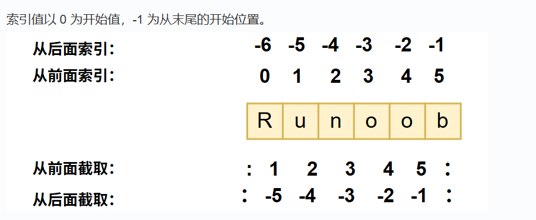

# python基础学习

## 1. python基础语法

- python中注释使用#来表示
- 由于python为unicode字符串，所以可以用中文作为标识符(变量名是表示符的子集，函数名类名之类的都为标识符)
- python的特色之一是以缩进表示代码块，相同缩进的代码为同一代码块
- python中有复数类型
- python中的单引号和双引号的意义相同
- python中的import表示导入一个模块的所有函数，from xxx import aaa表示导入aaa模块中的xxx库

## 2. python基本数据类型
python中的变量不需要声明

- 可变类型:数据可以改变，如list,dictionary,set
- 不可变类型:数据不可以改变，如Number,String,Tuple

**注**：
```
下面的a发生变化的原因不是把11给a，而是创建了11，把a指向新对象
a = 10
a = a + 1
```

### 2.1 string

string中截取的语法如下```变量名[头下标:尾下标]```

其中string从前往后下标从0开始向后数，从后往前是从-1向后数


### 2.2 bool

bool类型分为true和false，他们分别可以转换为1和0

### 2.3 list(列表)

列表像是一个强大的数组，里面的元素可以是任意数据类型，其索引规则和string类型相同

```
定义如下
list = ['a', 1, 1.34 , 'as']
```

list还有很多内置的方法

### 2.4 tuple(元组)

元组与列表类似，元组不能被修改，它被定义在小括号中

### 2.5 set(集合)

集合是一种无序，可变，用来储存唯一的元素，本质是哈希集合。

它可以进行求交集，并集等操作。

```
集合用{}来创建
param = {value1, value2,...}
或
a = set(asdqwerasd)
```

### 2.6 dictionary(字典)

字典和go中的map比较相似

## 3. python运算符

- a**b:为a的b次方
- a//b:为结果向下取整

## 4. python条件控制

python中将else if 简化为elif,在 if 条件 后面需要加上:,其余基本没有变化

## 5. python循环语句

### 5.1 while循环
while循环使用else语句

```
while条件为false时，执行else后的语句
while 条件 :
    ...
    ...
else :
    ...
```

简单语句组

```
while条件:执行语句
```

### 5.2 for循环

语法如下
```
其中else后的语句为for循环执行完后执行的语句
for 变量 in 集合
    语句
else 
    语句
```

## 6. 迭代器与生成器

迭代器是python中功能最强大的元素之一，它是访问集合元素的一种方式，迭代器有两种基本的方法，iter()和next()其中前者用来创建迭代器对象后者用来遍历。

在 Python 中，使用了 yield 的函数被称为生成器（generator），其余的知识等之后学习时单独写

## 7. with

with是try，finally的语法糖，with 语句通过上下文管理协议来管理资源释放等问题。

## 8. 函数

python函数用关键词def开头，一般格式如下:
```
def 函数名(参数列表):
    函数体
```


